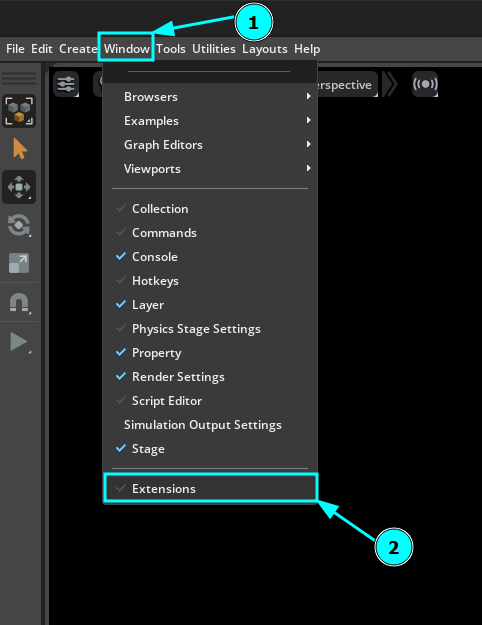
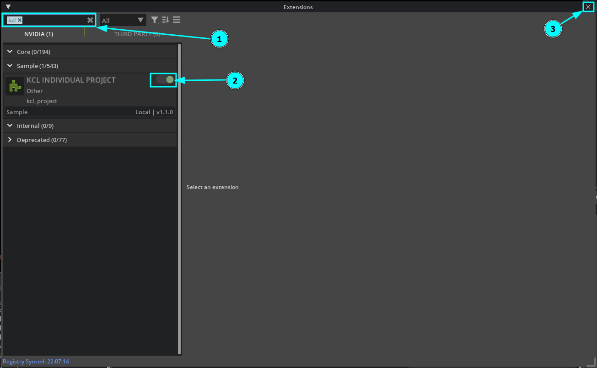

# Digital Twins For Onorbit Space Operations

| ROS2 Version | Isaac Sim Version | Link                                                                       |
|--------------|-------------------|----------------------------------------------------------------------------|
| ROS2 Humble  | 4.5               | [here](https://github.com/1412kauti/onorbit_digital_twin/tree/ros2-humble) |
| ROS2 Jazzy   | 5.0               | [here](https://github.com/1412kauti/onorbit_digital_twin/tree/ros2-jazzy)  |

# Enabling the Extension

# Usage
## Simple Docking

## Advanced Docking

## Visual Inspection

