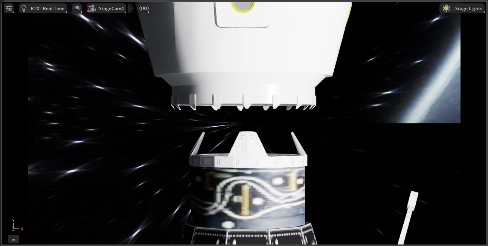

# Digital Twins For Onorbit Space Operations
| :warning: WARNING           |
|:----------------------------|
| Isaac 5.0(+ROS2 Jazzy Bridge) in development so (not stable) Use with extreme caution     |

| ROS2 Version | Isaac Sim Version | Link                                                                       |
|--------------|-------------------|----------------------------------------------------------------------------|
| ROS2 Humble  | 4.5               | [here](https://github.com/1412kauti/onorbit_digital_twin/tree/ros2-humble) |
| ROS2 Jazzy   | 5.0               | [here](https://github.com/1412kauti/onorbit_digital_twin/tree/ros2-jazzy)  |
## StageCam1

## StageCam2

## StageCam3

## StageCam4

## DragonXCam

## ISSCamera1

## LiDAR

## Rviz

# Enabling the Extension

# Usage
## Simple Docking

## Advanced Docking

## Visual Inspection

